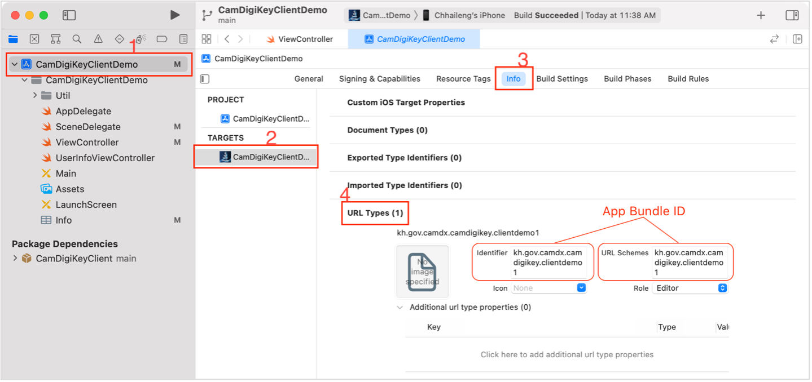

# Sample Code for CamDigiKey Integration with iOS

> This repository only includes sample codes for iOS mobile app integration with CamDigiKey, it is not a sample project.

To integrate app-to-app authentication with CamDigiKey app, a client must have an API server which its endpoints communicate with CamDigiKey server using CamDigiKey client library. Then, client mobile application requests to client API server to get `loginToken`. Through CamDigiKey mobile SDK, client mobile application then can call function to request authorization from CamDigiKey app. The following are the iOS integration steps:

## 1. Package (SDK) Installation

- Open Xcode project and select **File** > **Add Packages...**
- Click + and select **Add Swift Package Collection...**
- In the prompt, enter the URL to CamDigiKeyClient library repository and click **Load**

---

## 2. Create s DeepLink URL Scheme

- In the Xcode project, click on the project name and select your project target
- Open **Info** tab and expand **URL Types**
- Click + and enter App bundle ID as Identifier and URL Schemes



- Alternately, you can create a DeepLink URL Scheme via `info.plist` file as follow:

```xml
<key>CFBundleURLTypes</key> 
<array> 
  <dict> 
    <key>CFBundleTypeRole</key> 
    <string>Editor</string> 
    <key>CFBundleURLName</key> 
    <string>kh.gov.camdx.camdigikey.clientdemo1</string> 
    <key>CFBundleURLSchemes</key> 
    <array> 
      <string>kh.gov.camdx.camdigikey.clientdemo1</string> 
    </array> 
  </dict> 
</array> 
```

---

## 3. Login With CamDigiKey

- In `LoginViewController`, import CamDigiKey Client library

```swift
import CamDigiKeyClient
```

- Inside the function which handles login button, request to client API server to get `loginToken`
- Once the `loginToken` is responded, call `loginWithCamDigiKey` function

```swift
@IBAction func loginWithCamDigiKeyButtonClick(_ sender: UIButton) {
  // MARK : Step 1. Request `loginToken` from Client API Server
  let loginToken = "LOGIN_TOKEN_RESPONDED_FROM_CLIENT_API_SERVER"
  // MARK : Step 2. Generate Login Request with `loginToken` to CamDigiKey App
  CamDigiKeyClient.default.loginWithCamDigiKey(viewController: self, delegate: self, loginToken: loginToken)
}
```

- Once user authorized the login request in CamDigiKey app, an `authToken` will be returned and passed to client app via DeepLink. `LoginViewController` can get `authToken` by conform to `CamDigiKeyClientDelegate`.

```swift
extension LoginViewController: CamDigiKeyClientDelegate {
  func didAuthorizedLoginRequest(authToken: String) {
    print("Login success, authToken: \(authToken)")
    // MARK : Step 3. Request for `accessToken` with `authToken` from Client API Server
    // MARK : Step 4. Request for user information with `accessToken` from Client API Server
  }
  func didFailAuthorizedLoginRequest(message: String) {
    print("Login failed, message: \(message)")
  }
}
```

---

## 4. Handling DeepLink for Login Callback

- In `SceneDelegate`, import CamDigiKey Client library

```swift
import CamDigiKeyClient
```

- Override a function as following

```swift
extension SceneDelegate {
  func scene(_ scene: UIScene, openURLContexts URLContexts: Set<UIOpenURLContext>) {
    let rootVC = window?.rootViewController
    if let awaitingVC = rootVC?.presentedViewController as? CamDigiKeyAwaitingAuthorizationViewController {
      if let urlContext = URLContexts.first, let host = urlContext.url.host, host == "camdigikey_login_callback" {
        let data = URLComponents(url: urlContext.url, resolvingAgainstBaseURL: false)?.queryItems?.first
        if data?.name == "authToken" {
          awaitingVC.dismiss(animated: true) { 
            if let authToken = data?.value {
              awaitingVC.delegate?.didAuthorizedLoginRequest(authToken: authToken) 
            } else {
              awaitingVC.delegate?.didFailAuthorizedLoginRequest(message: "No Auth Token")
            }
          }
        } else {
          awaitingVC.dismiss(animated: true) {
            awaitingVC.delegate?.didFailAuthorizedLoginRequest(message: data?.value ?? "no errorMessage")
          }
        }
      }
    } else {
      let alert = UIAlertController(title: "Login Failed", message: "Login Request Has Been Canceled! Please Try Again", preferredStyle: .alert)
      alert.addAction(UIAlertAction(title: "OK", style: .default) { _ in
        rootVC?.dismiss(animated: true, completion: nil)
      })
      rootVC?.present(alert, animated: true, completion: nil)
    }
  }
}
```

---

## Contact us

- Tel: +855 81 922 329
- Email: info@techostartup.center
- Address: RUPP's Compound Russian Federation Blvd., Toul Kork, Phnom Penh, Cambodia